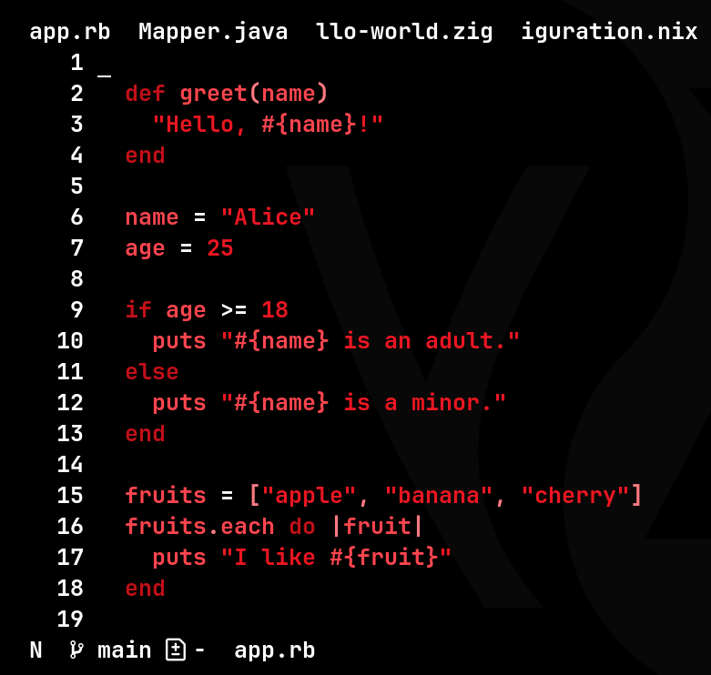
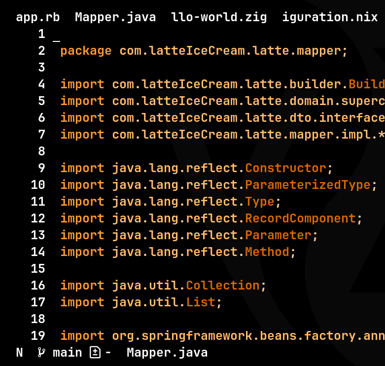
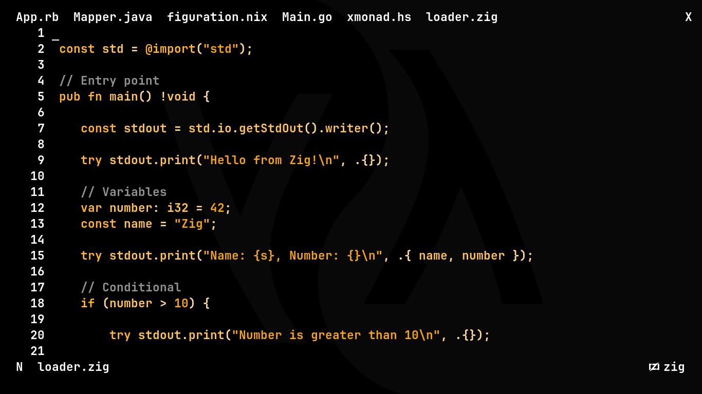
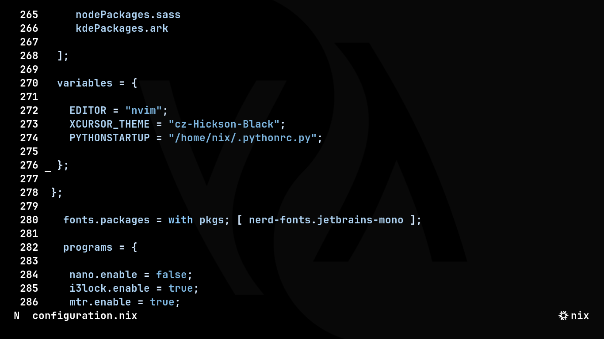
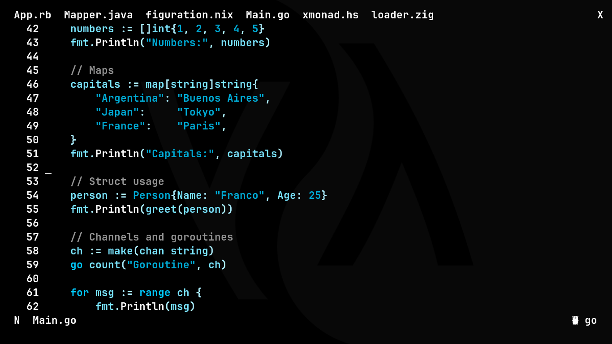
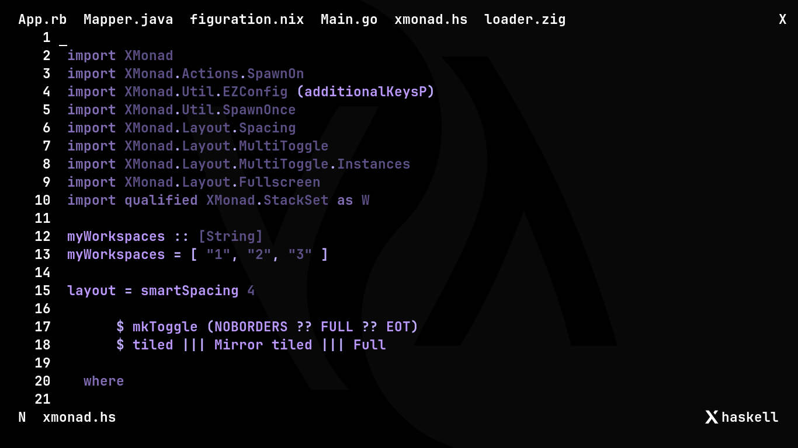

 # Prisma theme

 Prisma theme for Neovim. Why to have a single global theme when each language can has its own, define the colorscheme for each one and Prisma will load it when you open a file or switch to a tab with that language. 

 It has two layers of theming: `default`, it is the base theme, define there common styles across languages, `default` is also applied when the file doesn't has a type or there isn't a specific theme defined for that type in `lang` directory. There is where you must create `.lua` files with name convention to the languages names: `lang/java.lua` (Java theme), `lang/python.lua` (Python theme), etc.

 In the `main` branch of this repository is `testfiles` with different languages files which can you test the theme.

 ## Usage

 To integrate Prisma to your Neovim configuration is easy as:

 - Clone the repository (In `config` branch if you just want configuration files):
 ```
 git clone --branch config --single-branch https://github.com/FrancoBujakiewicz/prisma ~/.config/nvim/lua/
 ```
 - To load Prisma in your Neovim configuration (`init.lua`):
 ```lua
 require('prisma')
 ```
 ## Considerations

   - Ensure directory structure:

 ```
 ~/.config/nvim/
 ├─init.lua
 ├─lua/
   ├─lang/ # Languages specific themes.
   | ├─java.lua
   | ├─lua.lua # Ha ha 'lua.lua' so funny.
   | ├─ruby.lua
   ├─default.lua # Default theme.
   ├─prisma.lua # Dynamic loader.
 ```
 - The default theme have elements from plugins (e.g. `GitSignsAdd` or `TelescopeNormal`) it is based on this Neovim configuration: https://github.com/FrancoBujakiewicz/dotfiles/blob/main/nvim/init.lua.

 #

  <p align="center">

   
   
   
   
   
   

 </p>

 ## Future improvements

   - As you can see in [prisma.lua](./prisma.lua).
   - More integration with Neovim frameworks, and `.nvim` usage.

   ### Idea

